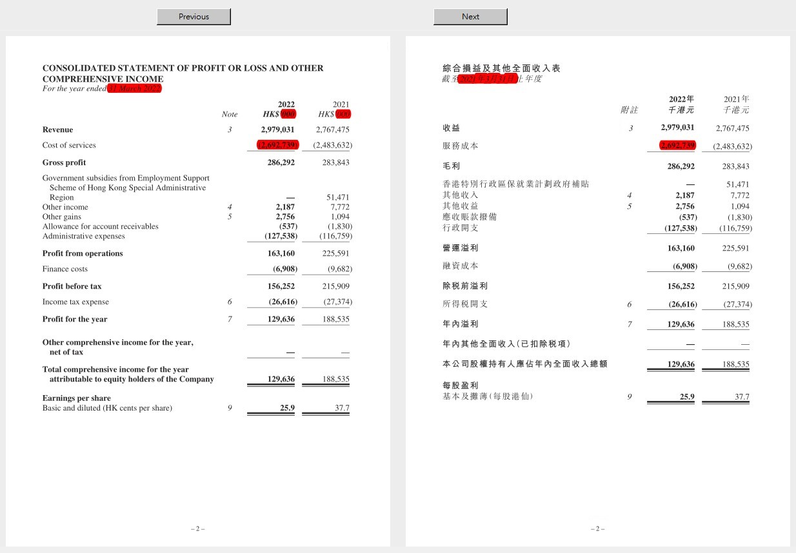

# Callfig Machine

This is a project done for my client, [Orange Financial Printing Limited](https://www.orangefinprinting.com/).

## Major Libraries Used
* pandas
* fitz (PyMuPDF)
* dateparser
* re
* tkinter
* PIL

## Pain Points
"Callfig" or "call figures" is a quality control process in printers and translation companies before the financial documents (like IPOs, annual reports) go to press. 

A meticulous review of the figures (including but not limited to amounts, dates, number indices) is one of the callfig tasks to make sure figures on both English and Chinese versions are consistent. This is an important but time-consuming job that would go wrong if it is not done without extra caution.

## Solution
Callfig Machine helps spot inconsistent figures instantly. Users just select the 2 PDF files they want to compare, then they can navigate through all pages to see which parts need amendments. The figures that could not be matched will be highlighted in red color.

