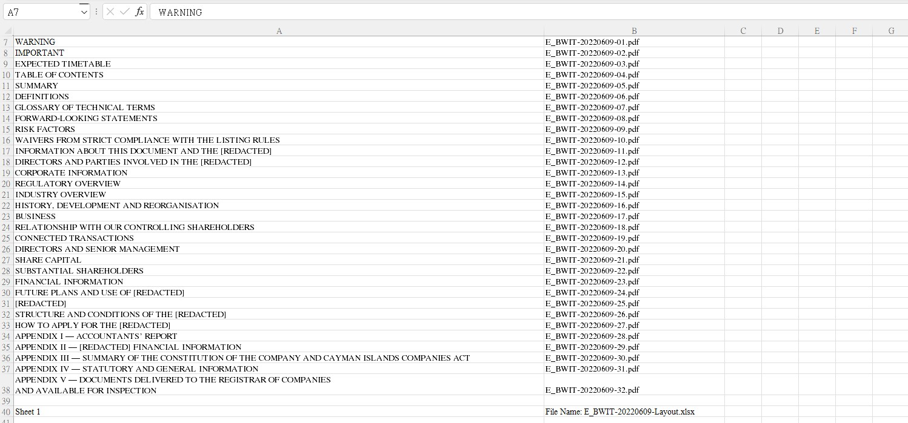
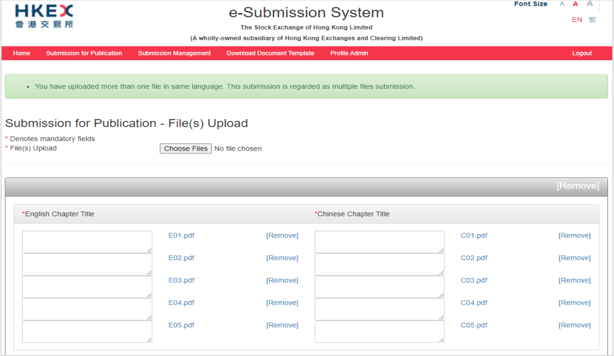
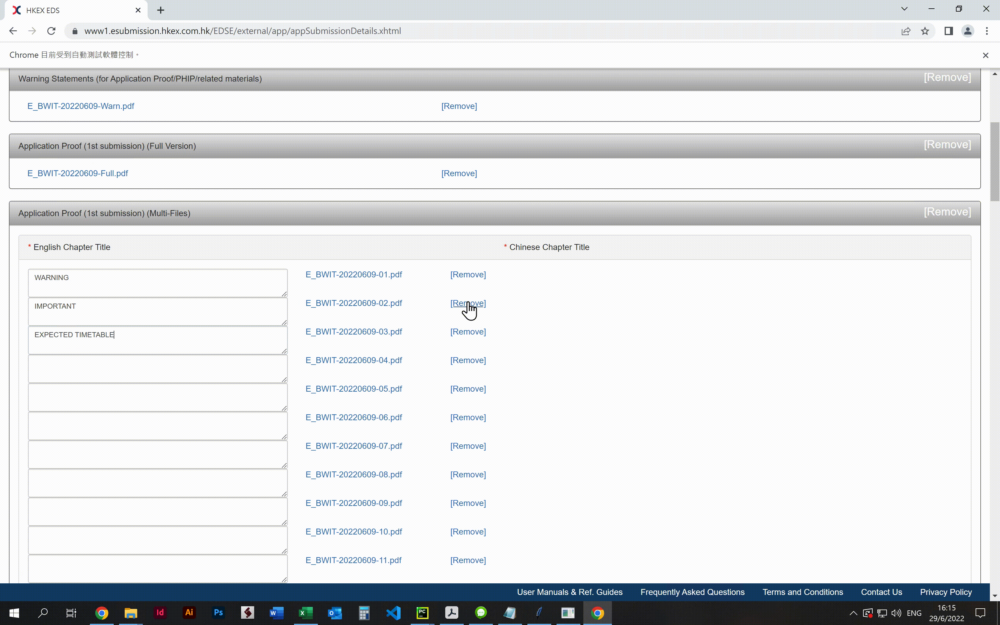

# ESS Form Filler

This is a project done for my client, [Orange Financial Printing Limited](https://www.orangefinprinting.com/).

## Major Libraries Used
* selenium
* pandas

## Pain Points
[e-Submission System (ESS)](https://www1.esubmission.hkex.com.hk/EDSE/main/login.xhtml) is an official internet-based system for submission of documents to the Stock Exchange of Hong Kong for publication.

The previous workflow was: 
1. Login to the ESS
2. Upload files
3. Open the local Excel file, where the chapter titles are stored
    
4. Copy and paste the chapter titles one by one from the Excel file to the corresponding fields
    
5. Submit

When a user needed to upload an IPO, they had to repeat the step 4 for over 50 times so the whole process usually took around 30 minutes or even more depending on the number of files. Also, there was a potential risk that the users might make mistake when filling in the fields.

## Solution
The ESS Form Filler automatically fills in all the fields with data stored at the local Excel file.

The new workflow now is:
1. Login to the ESS
2. Upload files
3. Run the program and let it fills the form automatically
    
4. Submit

The processing time is significantly reduced to less than 10 minutes and it has stable performance even with a large number of files. It also helps avoid careless mistakes caused by manual input.