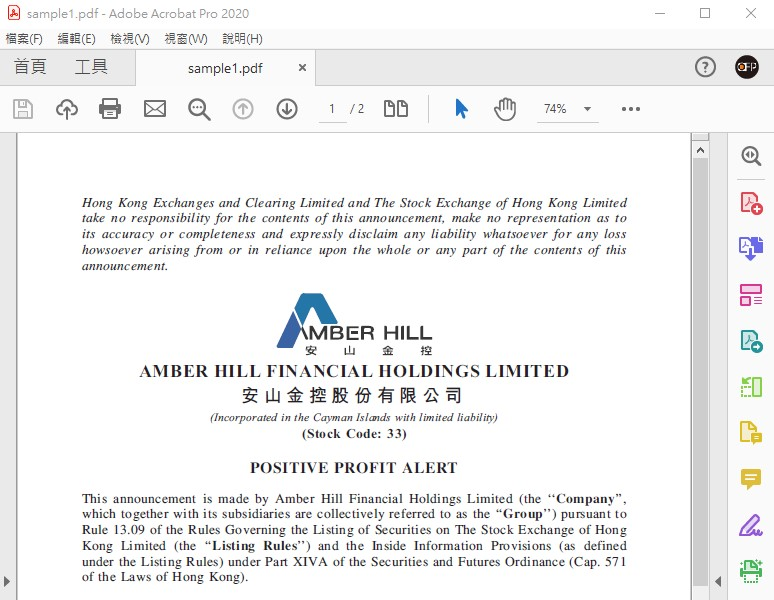
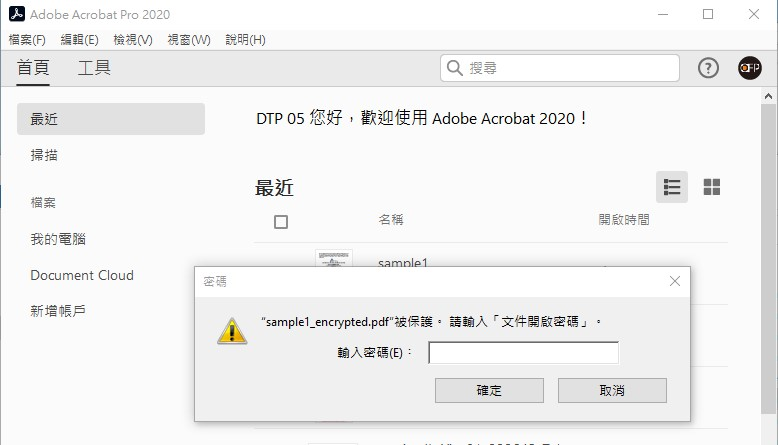
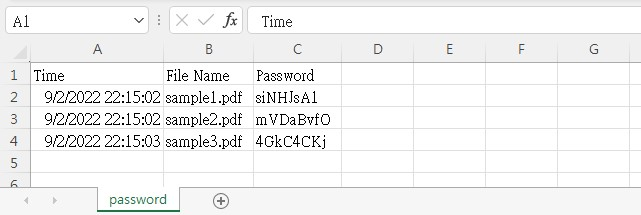

# PDF Encryption

This is a project done for my client, [Orange Financial Printing Limited](https://www.orangefinprinting.com/).

## Major Libraries Used
* PyPDF2
* random
* string
* pandas

## Pain Points
PDF encryption is a common task during external or internal file transfers. To improve security, sometimes it is necessary to generate random passwords for different PDF files. While there are many free password generators, when it comes to a bunch of files, it is time-consuming to encrypt them one by one, with different passwords, and store the passwords so they will not be lost.

## Solution
With this program, users can now specify a folder so that all PDF files in it will be encrypted with different randomly generated passwords. All these passwords will then be stored in an Excel file.

You may see the results as follows:
1. This is the PDF file to be encrypted
    
2. The PDF file requires password after encryption
    
3. All passwords are stored in the Excel file with timestamps
    